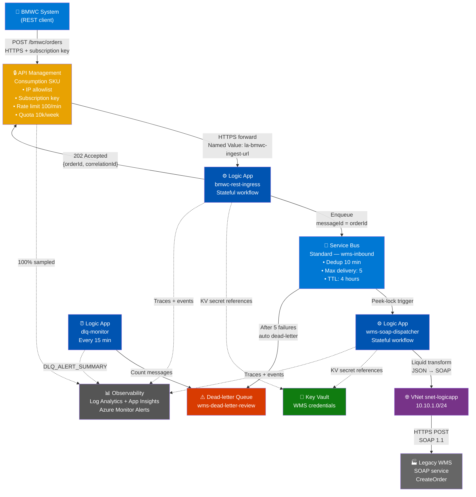
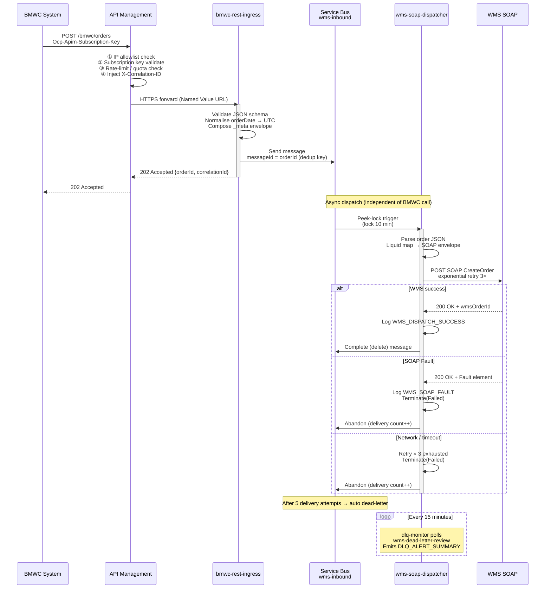

# BMWC → WMS REST-to-SOAP Bridge

> **Enterprise integration platform** — BMWC's modern REST order API dispatches asynchronously to a legacy WMS SOAP service via Azure API Management, Logic Apps Standard, and Service Bus. Designed for production deployment in Singapore (`southeastasia`) with Malaysia South (`malaysiasouth`) as a secondary region.

---

## Architecture

```
┌──────────────────────────────────────────────────────────────────────────┐
│                        BMWC Modern System                                │
│                     (JSON / HTTPS REST clients)                          │
└──────────────────────────────┬───────────────────────────────────────────┘
                               │ POST /bmwc/orders
                               ▼
┌──────────────────────────────────────────────────────────────────────────┐
│               Azure API Management (Consumption)                         │
│  • IP allowlist (BMWC CIDR)  • Subscription key auth                    │
│  • Rate-limit (100/min)      • X-Correlation-ID injection                │
│  • Quota (10k/week)          • App Insights 100% sampling                │
│  • Routes → Logic App HTTP trigger URL (Named Value)                     │
└──────────────────────────────┬───────────────────────────────────────────┘
                               │ HTTPS
                               ▼
┌──────────────────────────────────────────────────────────────────────────┐
│       Logic Apps Standard — bmwc-rest-ingress (Stateful)                 │
│  • Schema validation (orderId, customerId, warehouseCode, lines)         │
│  • UTC timestamp normalisation                                            │
│  • Enriches with _meta (correlationId, enqueuedAtUtc, source)            │
│  • Enqueues to Service Bus (messageId = orderId for dedup)               │
│  • Returns 202 Accepted                                                   │
└──────────────────────────────┬───────────────────────────────────────────┘
                               │ wms-inbound queue
                               ▼
┌──────────────────────────────────────────────────────────────────────────┐
│               Azure Service Bus (Standard) — wms-inbound                 │
│  • Duplicate detection (10 min)  • Lock duration: 10 min                 │
│  • Max delivery: 5               • TTL: 4 hours                          │
│  • Dead-letter → wms-dead-letter-review queue                            │
└──────────────────────────────┬───────────────────────────────────────────┘
                               │ peek-lock trigger
                               ▼
┌──────────────────────────────────────────────────────────────────────────┐
│       Logic Apps Standard — wms-soap-dispatcher (Stateful)               │
│  • Liquid map: JSON → SOAP 1.1 envelope                                  │
│  • Calls WMS CreateOrder (exponential retry 3× — 5s, 30s, 120s)         │
│  • Handles SOAP Fault vs. server error                                   │
│  • Logs WMS_DISPATCH_SUCCESS / WMS_SOAP_FAULT to App Insights            │
└──────────────────────────────┬───────────────────────────────────────────┘
                               │ HTTPS/SOAP (VNet — private outbound)
                               ▼
┌──────────────────────────────────────────────────────────────────────────┐
│               Legacy WMS SOAP Service (on-premises / private)            │
│               Operation: CreateOrder                                      │
│               (Demo: wms-soap-mock container on port 8080)               │
└──────────────────────────────────────────────────────────────────────────┘

┌──────────────────────────────────────────────────────────────────────────┐
│       Logic Apps Standard — dlq-monitor (Stateful, scheduled)            │
│  • Runs every 15 minutes                                                  │
│  • Counts wms-dead-letter-review queue depth                             │
│  • Emits DLQ_ALERT_SUMMARY event to App Insights                        │
│  • Azure Monitor alert fires when count > 0                              │
└──────────────────────────────────────────────────────────────────────────┘

Observability — cross-cutting:
  Log Analytics workspace  ←  Logic Apps + APIM + Service Bus diagnostics
  Application Insights     ←  Distributed traces, structured events
  Azure Monitor            ←  6 alert rules (RunsFailed, DLQ, Latency, APIM 5xx, …)
```

### Component Diagram



### End-to-End Order Flow



---

## Azure Services

| Service | SKU | Purpose |
|---|---|---|
| API Management | Consumption | Secure REST ingress, IP allowlist, rate limiting, correlation |
| Logic Apps Standard | WS1 | Orchestration, JSON→SOAP transform, retry, DLQ monitoring |
| Service Bus | Standard | Async buffer, duplicate detection, dead-letter queue |
| VNet | — | Private outbound from Logic Apps to WMS (10.10.0.0/16) |
| Key Vault | Standard | WMS endpoint URL and credentials as KV secret references |
| Log Analytics | PerGB2018 | Centralised log store, 30d demo / 90d production |
| Application Insights | — | Distributed traces, structured event telemetry |
| Storage Account | LRS | Logic Apps Standard runtime state |

**Primary region**: Southeast Asia (Singapore) `southeastasia`  
**Secondary region**: Malaysia South `malaysiasouth` — independent deployment via `main.parameters.prod-my.json`

---

## Repo Structure

```
AppLogic/
├── infra/
│   ├── main.bicep                        # Subscription-scoped Bicep orchestrator
│   ├── main.parameters.json              # azd env-var bindings (all environments)
│   ├── main.parameters.demo.json         # Demo defaults — permissive, Singapore
│   ├── main.parameters.prod-sg.json      # Production — hardened, Singapore
│   ├── main.parameters.prod-my.json      # Production — hardened, Malaysia South
│   └── modules/
│       ├── apim.bicep                    # APIM + BMWC API definition + IP-filter policy
│       ├── alerts.bicep                  # 6 Azure Monitor alert rules
│       ├── keyvault.bicep                # Key Vault + WMS credential secrets
│       ├── loganalytics.bicep            # Log Analytics + Application Insights
│       ├── logicapp.bicep                # Logic Apps Standard WS1 + App Service Plan
│       ├── servicebus.bicep              # Service Bus namespace + queues
│       └── vnet.bicep                    # VNet + subnets + NSGs
├── logic-app/
│   ├── host.json                         # Logic Apps runtime config (extensionBundle)
│   ├── connections.json                  # Service Bus built-in connector declaration
│   ├── parameters.json                   # Workflow parameter → app setting bindings
│   ├── lib/
│   │   └── maps/                         # Liquid maps consumed by Logic Apps runtime
│   │       ├── bmwc-order-to-wms-soap.liquid
│   │       └── wms-soap-response-to-json.liquid
│   └── workflows/
│       ├── bmwc-rest-ingress/            # HTTP trigger → validate → enqueue → 202
│       │   └── workflow.json
│       ├── wms-soap-dispatcher/          # SB trigger → Liquid transform → WMS SOAP call
│       │   └── workflow.json
│       └── dlq-monitor/                  # Recurrence → count DLQ → log alert summary
│           └── workflow.json
├── maps/                                 # Canonical Liquid map source (mirrors lib/maps/)
│   ├── bmwc-order-to-wms-soap.liquid
│   └── wms-soap-response-to-json.liquid
├── apim-policies/
│   ├── global-policy.xml                 # Correlation ID injection (all APIs)
│   ├── bmwc-api-policy.xml               # Rate-limit, IP-filter, backend routing
│   ├── post-order-operation-policy.xml   # POST /bmwc/orders operation policy
│   ├── get-status-operation-policy.xml   # GET /bmwc/orders/{id}/status policy
│   └── openapi-bmwc-wms-bridge.yaml      # OpenAPI 3.0 definition for BMWC API
├── mocks/
│   └── wms-soap-mock/
│       ├── server.js                     # Express SOAP mock — CreateOrder endpoint
│       ├── package.json
│       └── Dockerfile
├── tests/
│   ├── bmwc-order.http                   # VS Code REST Client integration tests
│   ├── BMWC-WMS-Bridge.postman_collection.json  # Postman collection (7 scenarios)
│   ├── curl-demo.sh                      # End-to-end bash demo script
│   ├── DEMO-SCRIPT.md                    # Presenter script with narration + Q&A
│   ├── EXPECTED-OUTPUTS.md               # Per-layer expected values for each scenario
│   ├── log-analytics-queries.kql         # 12 KQL queries (import as Saved Queries)
│   ├── payloads/                         # Sample BMWC request payloads
│   │   ├── 01-success-standard.json
│   │   ├── 02-success-urgent-timezone.json
│   │   ├── 03-transient-failure.json
│   │   ├── 04-dlq-trigger.json
│   │   ├── 05-invalid-missing-required.json
│   │   ├── 06-invalid-orderid-pattern.json
│   │   └── 07-idempotency-duplicate.json
│   └── wms-responses/                    # WMS SOAP mock response examples
│       ├── wms-response-success.xml
│       ├── wms-response-soap-fault.xml
│       └── wms-response-server-fault.xml
├── scripts/
│   └── post-provision.ps1                # azd postprovision hook: wire APIM → LA trigger URL
├── azure.yaml                            # azd project definition
├── .env.example                          # Full environment variable reference
├── .gitignore
│
│   Design docs
├── ARCHITECTURE.md                       # Logical architecture + decision log
├── API_CONTRACT.md                       # Canonical JSON schema + field reference
├── TRANSFORMATION_SPEC.md                # JSON→SOAP field mapping + Liquid map reference
├── APIM_DESIGN.md                        # APIM policy chain + OpenAPI design
├── SERVICE_BUS_DESIGN.md                 # Queue configuration + dead-letter design
├── NETWORK_DESIGN.md                     # VNet topology + NSG rules
└── OBSERVABILITY_DESIGN.md              # Log Analytics queries + alert rule spec
```

---

## Workflows

### `bmwc-rest-ingress` — HTTP trigger → Service Bus

Triggered by APIM forwarding a `POST /bmwc/orders` call. Acts as the firewall and intake valve for all orders.

| Step | Action |
|---|---|
| 1 | Receive `POST` — read or generate `X-Correlation-ID` |
| 2 | Validate JSON schema (`orderId`, `customerId`, `warehouseCode`, `lines[]` required) |
| 3 | Normalise `orderDate` to UTC (strip `+08:00` or any offset) |
| 4 | Compose `_meta` envelope (`correlationId`, `enqueuedAtUtc`, `source`, `schemaVersion`) |
| 5 | Send enriched message to `wms-inbound` queue — `messageId = orderId` (dedup key) |
| 6 | Return `202 Accepted` `{ orderId, correlationId, message }` |
| 7 | On Service Bus failure → return `500` with `correlationId` |

### `wms-soap-dispatcher` — Service Bus trigger → WMS SOAP

Dequeues from `wms-inbound` in peek-lock mode and dispatches to the WMS. The lock and retry budget are the durability guarantee.

| Step | Action |
|---|---|
| 1 | Dequeue message (peek-lock, 10-min lock) |
| 2 | Recover `correlationId` from message `userProperties` |
| 3 | Parse canonical order JSON from message body |
| 4 | Transform JSON → SOAP 1.1 envelope via Liquid map |
| 5 | `POST` to WMS endpoint — exponential retry 3× (5s → 30s → 120s) |
| 6 | `200 OK` with `<wms:Status>SUCCESS</wms:Status>` → log `WMS_DISPATCH_SUCCESS`, complete message |
| 7 | SOAP Fault → log `WMS_SOAP_FAULT`, terminate run; Service Bus increments delivery count |
| 8 | After 5 delivery attempts → Service Bus dead-letters automatically |

### `dlq-monitor` — Recurrence → DLQ check

Runs on a 15-minute schedule. Provides ops visibility without requiring queue polling by humans.

| Step | Action |
|---|---|
| 1 | Trigger every 15 minutes |
| 2 | Get `wms-dead-letter-review` queue message count |
| 3 | If count > 0 → emit `DLQ_ALERT_SUMMARY` to App Insights |
| 4 | Azure Monitor alert rule `alert-dlq-present-{env}` fires when count > 0 |

---

## Naming Conventions

| Resource | Pattern | Example |
|---|---|---|
| Resource Group | `rg-bmwc-wms-{env}` | `rg-bmwc-wms-prod-sg` |
| Logic App | `la-bmwc-wms-{token}` | `la-bmwc-wms-abc123` |
| App Service Plan | `asp-bmwc-wms-{token}` | `asp-bmwc-wms-abc123` |
| Service Bus | `sb-bmwc-wms-{token}` | `sb-bmwc-wms-abc123` |
| SB queue — inbound | `wms-inbound` | — |
| SB queue — dead-letter review | `wms-dead-letter-review` | — |
| Key Vault | `kv-bmwc-{token}` | `kv-bmwc-abc123` |
| APIM | `apim-bmwc-{env}` | `apim-bmwc-prod-sg` |
| VNet | `vnet-bmwc-wms-{token}` | — |
| Log Analytics | `log-bmwc-wms-{token}` | — |
| App Insights | `appi-bmwc-wms-{token}` | — |
| Workflow names | `{source}-{verb}-{noun}` | `bmwc-rest-ingress`, `wms-soap-dispatcher`, `dlq-monitor` |
| APIM API base path | `bmwc` | `/bmwc/orders` |
| KV secrets | `wms-soap-{attribute}` | `wms-soap-endpoint`, `wms-soap-password` |

---

## Live Demo Environment

The demo environment is **currently deployed** in Azure (Southeast Asia — Singapore):

| Resource | Value |
|---|---|
| Resource Group | `rg-bmwc-wms-demo` |
| APIM Gateway URL | `https://apim-bmwc-wms-2yh2gijmhmpp6.azure-api.net` |
| Logic App | `la-bmwc-wms-2yh2gijmhmpp6` (Running) |
| Service Bus | `sb-bmwc-wms-2yh2gijmhmpp6` (Active) |

**Get the APIM subscription key** (needed for all API calls):

```powershell
$subId = az account show --query id -o tsv
$keys = az rest --method POST `
  --url "https://management.azure.com/subscriptions/$subId/resourceGroups/rg-bmwc-wms-demo/providers/Microsoft.ApiManagement/service/apim-bmwc-wms-2yh2gijmhmpp6/subscriptions/bmwc-demo-subscription/listSecrets?api-version=2022-08-01" `
  -o json | ConvertFrom-Json
Write-Host "Subscription Key: $($keys.primaryKey)"
```

### Run a test order (PowerShell)

```powershell
$APIM_URL = "https://apim-bmwc-wms-2yh2gijmhmpp6.azure-api.net"
$SUB_KEY  = "<key from above>"
$ORDER_ID = "ORD-2026-SGP-$(Get-Date -Format 'HHmmss')"   # unique each run
$CORR_ID  = "test-corr-$(Get-Date -Format 'yyyyMMddHHmmss')"

$body = Get-Content "tests/payloads/01-success-standard.json" | ConvertFrom-Json
$body.orderId = $ORDER_ID

Invoke-WebRequest -Uri "$APIM_URL/bmwc/orders" `
  -Method POST `
  -Headers @{
      "Ocp-Apim-Subscription-Key" = $SUB_KEY
      "X-Correlation-ID"          = $CORR_ID
      "Content-Type"              = "application/json"
  } `
  -Body ($body | ConvertTo-Json -Depth 10) `
  -UseBasicParsing | Select-Object StatusCode, Content
```

### Run a test order (curl / bash)

```bash
APIM_URL="https://apim-bmwc-wms-2yh2gijmhmpp6.azure-api.net"
SUB_KEY="<key from above>"
ORDER_ID="ORD-2026-SGP-$(date +%H%M%S)"

curl -s -X POST "$APIM_URL/bmwc/orders" \
  -H "Content-Type: application/json" \
  -H "Ocp-Apim-Subscription-Key: $SUB_KEY" \
  -H "X-Correlation-ID: test-corr-$(date +%s)" \
  -d "$(jq --arg id "$ORDER_ID" '.orderId = $id' tests/payloads/01-success-standard.json)"
```

See [tests/DEMO-SCRIPT.md](tests/DEMO-SCRIPT.md) for the full presenter walkthrough with all 7 scenarios.

---

## Quick Start

### Prerequisites

- [Azure CLI](https://learn.microsoft.com/cli/azure/install-azure-cli) ≥ 2.57
- [Azure Developer CLI (azd)](https://learn.microsoft.com/azure/developer/azure-developer-cli/install-azd) ≥ 1.7
- PowerShell 7+
- Node.js 18+ (for WMS mock)
- Docker (optional — for containerised mock)

### 1. Clone and configure

```bash
git clone https://github.com/polyfuze4336-bot/bmwc-wms-integration-bridge.git
cd bmwc-wms-integration-bridge
```

### 2. Start the local WMS mock

```bash
cd mocks/wms-soap-mock
npm install
npm start
# Mock runs on http://localhost:8080
# WSDL:   http://localhost:8080/WMSService.svc?wsdl
# Health: http://localhost:8080/health
```

### 3. Provision infrastructure

```powershell
azd auth login
azd env new demo
azd env set AZURE_LOCATION southeastasia
azd env set WMS_USERNAME bmwc_api
azd env set WMS_PASSWORD <wms-password>
azd env set APIM_PUBLISHER_EMAIL ops@bmwc.example.com

# Demo deployment (permissive defaults — Singapore)
azd provision --parameters infra/main.parameters.demo.json

# Production Singapore
azd provision --parameters infra/main.parameters.prod-sg.json
```

`azd provision` will:
1. Deploy all 7 Bicep modules in dependency order
2. Run `scripts/post-provision.ps1` automatically — wires APIM Named Value `la-bmwc-ingest-url` to the Logic App trigger URL

### 4. Deploy Logic App workflows

The Logic App uses identity-based blob storage (`allowSharedKeyAccess: false`). Workflows must be deployed via blob storage — **not** via Kudu zip deploy.

**Step 4a — Grant your user blob data access:**

```powershell
$storageId = az storage account show `
  --name <STORAGE_ACCOUNT_NAME> `
  --resource-group <RESOURCE_GROUP> `
  --query id -o tsv
$userId = az ad signed-in-user show --query id -o tsv

az role assignment create `
  --assignee $userId `
  --role "Storage Blob Data Contributor" `
  --scope $storageId
# Wait ~10 minutes for RBAC to propagate before continuing
```

**Step 4b — Create deployment container and upload zip:**

```powershell
# Create the container via ARM (no shared key needed)
az rest --method PUT `
  --url "https://management.azure.com$storageId/blobServices/default/containers/deployments?api-version=2023-01-01" `
  --body '{\"properties\":{\"publicAccess\":\"None\"}}' | Out-Null

# Build and upload the zip
Compress-Archive -Path "logic-app\*" -DestinationPath "logic-app-deploy.zip" -Force

$token   = az account get-access-token --resource "https://storage.azure.com/" --query accessToken -o tsv
$account = az storage account show --name <STORAGE_ACCOUNT_NAME> --resource-group <RESOURCE_GROUP> --query name -o tsv
$uri     = "https://$account.blob.core.windows.net/deployments/logic-app.zip"
$headers = @{ Authorization="Bearer $token"; "x-ms-version"="2020-04-08"; "x-ms-blob-type"="BlockBlob"; "Content-Type"="application/zip" }
Invoke-WebRequest -Method PUT -Uri $uri -Headers $headers -Body ([System.IO.File]::ReadAllBytes("logic-app-deploy.zip")) -UseBasicParsing
```

**Step 4c — Point Logic App at the blob package:**

```powershell
$blobUrl = "https://$account.blob.core.windows.net/deployments/logic-app.zip"
az webapp config appsettings set `
  --name <LOGIC_APP_NAME> `
  --resource-group <RESOURCE_GROUP> `
  --settings "WEBSITE_RUN_FROM_PACKAGE=$blobUrl"

# Restart to apply the new package
az webapp restart --name <LOGIC_APP_NAME> --resource-group <RESOURCE_GROUP>
```

**Step 4d — Re-run the post-provision hook** to refresh the APIM trigger URL:

```powershell
$env:RESOURCE_GROUP_NAME = "<RESOURCE_GROUP>"
$env:LOGIC_APP_NAME      = "<LOGIC_APP_NAME>"
$env:APIM_NAME           = "<APIM_NAME>"
$env:AZURE_SUBSCRIPTION_ID = az account show --query id -o tsv
.\scripts\post-provision.ps1
```

### 5. Run the demo

```powershell
# PowerShell
$APIM_URL = "https://<apim-name>.azure-api.net"
$SUB_KEY  = az rest --method POST `
  --url "https://management.azure.com/subscriptions/$(az account show --query id -o tsv)/resourceGroups/<rg>/providers/Microsoft.ApiManagement/service/<apim>/subscriptions/bmwc-demo-subscription/listSecrets?api-version=2022-08-01" `
  -o json | ConvertFrom-Json | Select-Object -ExpandProperty primaryKey

$body = Get-Content "tests/payloads/01-success-standard.json" | ConvertFrom-Json
$body.orderId = "ORD-2026-SGP-$(Get-Date -Format 'HHmmss')"

Invoke-WebRequest -Uri "$APIM_URL/bmwc/orders" `
  -Method POST `
  -Headers @{"Ocp-Apim-Subscription-Key"=$SUB_KEY;"Content-Type"="application/json"} `
  -Body ($body | ConvertTo-Json -Depth 10) -UseBasicParsing
```

```bash
# bash — run all 7 scenarios end-to-end
bash tests/curl-demo.sh
```

Or import `tests/BMWC-WMS-Bridge.postman_collection.json` into Postman and set `apimGatewayUrl` + `subscriptionKey` environment variables.

### 6. Rotate WMS credentials (production)

```bash
az keyvault secret set \
  --vault-name $KEY_VAULT_NAME \
  --name wms-soap-password \
  --value "<real-password>"
```

---

## Demo Scenarios

| # | Scenario | File | What it demonstrates |
|---|---|---|---|
| 1 | Success — standard order | `payloads/01-success-standard.json` | Full happy path, lot-tracked item |
| 2 | Success — URGENT + GMT+8 | `payloads/02-success-urgent-timezone.json` | UTC normalisation from +08:00 |
| 3 | Transient WMS failure | `payloads/03-transient-failure.json` | Retry + lock behaviour |
| 4 | DLQ consolidation | `payloads/04-dlq-trigger.json` | Bad SKU → DLQ alert |
| 5 | Invalid request | `payloads/05-invalid-missing-required.json` | Schema gate — never reaches SB |
| 6 | orderId pattern violation | `payloads/06-invalid-orderid-pattern.json` | Pattern `^[A-Z0-9\-]+$` enforced |
| 7 | Idempotency | `payloads/07-idempotency-duplicate.json` | Service Bus dedup in 10-min window |

Expected outputs for every scenario at every layer: [tests/EXPECTED-OUTPUTS.md](tests/EXPECTED-OUTPUTS.md)  
12 KQL queries ready to import: [tests/log-analytics-queries.kql](tests/log-analytics-queries.kql)

---

## Parameter Files

| File | Target | Region | Key settings |
|---|---|---|---|
| `main.parameters.demo.json` | Demo / POC | `southeastasia` | 30d log retention, 1GB quota cap, 3 workers, purge protection off |
| `main.parameters.prod-sg.json` | Production | `southeastasia` | 90d retention, unlimited quota, 10 workers, purge protection on, sampling 10% |
| `main.parameters.prod-my.json` | Production (DR) | `malaysiasouth` | Same as prod-sg, separate WMS endpoint |

All sensitive parameters (`wmsUsername`, `wmsPassword`) must be supplied at deploy time via `azd env set` — they are never stored in parameter files.

---

## Production Hardening Checklist

- [ ] Upgrade APIM to **Developer** or **Premium** SKU for VNet injection
- [ ] Add `<validate-jwt>` APIM policy for Entra ID token enforcement
- [ ] Switch Service Bus to **Premium** SKU for private endpoints
- [ ] Add Key Vault private endpoint (subnet `snet-private-endpoints`)
- [ ] Replace Service Bus connection string with Managed Identity RBAC (`Service Bus Data Sender/Receiver`)
- [ ] Wire Alert Action Group: APIM → Monitor → Action Groups → set `actionGroupId` parameter
- [ ] Enable Logic App IP restriction (allow only APIM outbound IPs)
- [ ] Add Azure Front Door or Traffic Manager across `prod-sg` and `prod-my` APIM gateway URLs for DR failover
- [ ] Set `disableLocalAuth: true` on Service Bus after Managed Identity migration

---

## Known Constraints

### Logic App Standard — Azure Files requirement with `allowSharedKeyAccess: false`

**Symptom:** Logic App runtime enters `Error` state with:
```
System.Private.CoreLib: Access to the path 'C:\home\data\Functions\secrets\Sentinels' is denied.
```

**Root cause:** Logic Apps Standard on the **Workflow Service Plan** (WS1/WS2/WS3) _always_ requires Azure Files (SMB) for the home directory runtime state (`C:\home`). Azure Files SMB authentication requires `allowSharedKeyAccess: true` on the storage account. If an Azure Policy enforces `allowSharedKeyAccess: false` (common in FDPO / enterprise tenants), the Azure Files mount fails and the runtime cannot start.

> **Microsoft officially confirms** ([docs](https://learn.microsoft.com/en-us/azure/logic-apps/create-single-tenant-workflows-azure-portal#set-up-managed-identity-access-to-your-storage-account)):  
> *"Currently, you can't disable storage account key access for Standard logic apps that use the Workflow Service Plan hosting option."*

`AzureWebJobsStorage__credentialType=managedIdentity` configures identity-based authentication for **blob/queue/table** operations, but the **Azure Files SMB mount** (`WEBSITE_CONTENTAZUREFILECONNECTIONSTRING`) still requires shared key access. No app-setting workaround (`AzureWebJobsSecretStorageType`, `AzureWebJobsSecretsPath`, etc.) can bypass this.

**Workarounds (choose one):**

| Option | Description |
|--------|-------------|
| **Policy exemption** | Request a policy exemption for the storage account in this resource group. Fastest for demo environments. |
| **App Service Environment v3 (ASEv3)** | Switch hosting to ASEv3 plan, which supports full managed-identity storage without shared key access. Requires infrastructure changes to the App Service Plan. |
| **Subscription without policy** | Deploy to a subscription/tenant that does not enforce `allowSharedKeyAccess: false`. |
